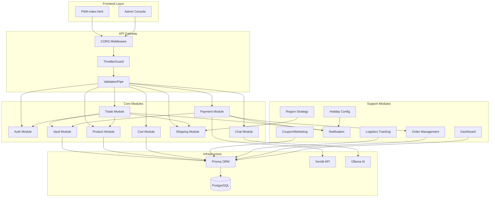
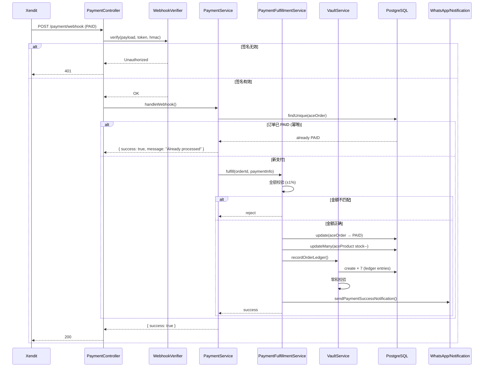

# AceProxy — 架构概览

> 版本: 1.0 | 最后更新: 2026-06

---

## 1. 项目概览

**AceProxy** 是一个面向东南亚市场的跨境电商代购平台 MVP。
用户通过 AceProxy 可以从中国工厂（1688）采购商品，享受 AI 质检、真空包装和国际物流一站式服务。

### 定位

- **目标市场**: 印尼 (ID)、泰国 (TH)、菲律宾 (PH)
- **核心用户**: 中产消费者、小批发商、C2C 转卖团长
- **价值主张**: 工厂直供 → AI 质检 → 真空包装 → 7-10 天门到门

### 技术栈

| 层级 | 技术 | 说明 |
|------|------|------|
| 前端 PWA | HTML5 / CSS3 / Vanilla JS | 移动优先，支持 PWA 离线 |
| 管理后台 | HTML5 / Chart.js | 实时仪表盘，独立部署 |
| 后端框架 | NestJS (Node.js) | 模块化架构，TypeScript |
| ORM | Prisma | PostgreSQL 数据库访问 |
| 数据库 | PostgreSQL 14+ | 主数据存储 |
| AI 引擎 | Ollama (本地) | Qwen2.5 7B，推理服务 |
| 支付 | Xendit | 印尼支付网关 |
| 容器化 | Docker / Docker Compose | 一键部署 |

### 架构图（文字描述）

```
┌──────────────────────────────────────────────────────┐
│                     用户端 (PWA)                      │
│  deploy/index.html + api-client.js                   │
│  ┌─────┬─────┬─────┬─────┬─────┬─────┐              │
│  │Home │Disc │Asst │Wallet│Resale│Profile│            │
│  └──┬──┴──┬──┴──┬──┴──┬──┴──┬───┴───┬──┘            │
└─────┼─────┼─────┼─────┼─────┼───────┼───────────────┘
      │     │     │     │     │       │
      ▼     ▼     ▼     ▼     ▼       ▼
┌──────────────────────────────────────────────────────┐
│              AceProxy API Server (:3001)              │
│              NestJS + Prisma + JWT                    │
│  ┌──────┬──────┬──────┬──────┬──────┬──────┐        │
│  │Auth  │Product│Trade │Payment│Vault │Chat  │        │
│  │Register│List  │Create│Invoice│Ledger│Ollama│       │
│  │Login │Detail│Fee   │Webhook│Settle│Steward│       │
│  └──┬───┴──┬───┴──┬───┴──┬───┴──┬───┴──┬───┘        │
└─────┼──────┼──────┼──────┼──────┼──────┼────────────┘
      │      │      │      │      │      │
      ▼      ▼      ▼      ▼      ▼      ▼
┌──────────────────────────────────────────────────────┐
│               PostgreSQL 14+                          │
│  ace_user, ace_product, ace_order, ace_vault_ledger   │
│  ace_coupon, ace_holiday_config, ace_cart_item, etc.  │
└──────────────────────────────────────────────────────┘
      │                    │
      ▼                    ▼
┌──────────┐     ┌────────────────┐
│  Xendit  │     │  Ollama (AI)   │
│ (支付)   │     │  Qwen2.5 7B    │
└──────────┘     └────────────────┘

┌──────────────────────────────────────────────────────┐
│              管理后台 (admin.html)                    │
│  Dashboard / Orders / Logistics / Vault / Products    │
└──────────────────────────────────────────────────────┘
```

### 模块依赖拓扑图 (Mermaid)



---

## 2. 目录结构

```
ace-proxy/
├── apps/
│   └── server/                    # NestJS 后端
│       ├── src/
│       │   ├── main.ts            # 入口 + Swagger
│       │   ├── app.module.ts      # 根模块
│       │   ├── common/            # 通用工具
│       │   │   ├── exchange-rate.ts     # 汇率管理
│       │   │   ├── WebhookVerifier.ts   # Webhook 签名
│       │   │   ├── csv-escape.ts        # CSV 安全
│       │   │   ├── interceptors/        # API 响应拦截器
│       │   │   └── guards/              # 限流守卫
│       │   ├── modules/
│       │   │   ├── auth/           # 认证 (JWT)
│       │   │   ├── product/        # 商品管理
│       │   │   ├── trade/          # 交易订单
│       │   │   ├── payment/        # Xendit 支付
│       │   │   ├── vault/          # 财务金库
│       │   │   ├── cart/           # 购物车
│       │   │   ├── shipping/       # 物流运费
│       │   │   ├── chat/           # AI 对话
│       │   │   ├── marketing/      # 优惠券
│       │   │   ├── holiday/        # 节日 UI
│       │   │   ├── notification/   # 推送通知
│       │   │   ├── dashboard/      # 数据仪表盘
│       │   │   ├── logistics-tracking/ # 物流跟踪
│       │   │   ├── order/          # 订单管理
│       │   │   └── region/         # 区域策略
│       │   ├── prisma/             # Prisma 服务
│       │   ├── dto/                # 数据传输对象
│       │   └── countries/          # 多国配置 (id/th/ph)
│       ├── prisma/
│       │   ├── schema.prisma       # 数据模型
│       │   └── migrations/         # 迁移文件
│       ├── jest.config.ts          # 测试配置
│       ├── Dockerfile
│       └── package.json
├── deploy/
│   ├── index.html                  # PWA 主文件
│   ├── admin.html                  # 管理后台
│   ├── api-client.js               # API 客户端
│   └── manifest.json               # PWA manifest
├── docs/
│   ├── ARCHITECTURE.md             # 本文档
│   └── DEPLOYMENT.md               # 部署手册
├── docker-compose.yml              # 容器编排
├── dev.bat / test.bat              # 开发脚本
└── README.md
```

---

## 3. 核心模块职责

### Auth (认证)
- **AuthService**: 注册、登录、JWT 签发、密码 bcrypt 哈希
- **JwtStrategy**: Passport JWT 策略验证，从 token 提取 userId
- **JwtAuthGuard**: 全局认证守卫，保护需要登录的端点

### Product (商品)
- **ProductService**: 商品 CRUD、库存扣减（乐观锁重试 3 次指数退避）、列表分页
- **ProductController**: REST API — `/product/list`(分页/搜索/分类)、`/product/:id`

### Trade (交易)
- **TradeService**: 创建订单、合规确认（跨境代购协议）、费用分级计算
- **TradeController**: 代购协议确认、订单创建、Salvage 补偿操作
- 依赖: VaultService（分账）、ProductService（库存）、NotificationService（通知）

### Vault (金库)
- **VaultService**: 全链路零和分账（7 条分录）、拒付处理、结算 payout
- 分账优先级: RiskPool(1.5%) > Cost > Shipping > Commission(2%) > Rebate > Profit
- 零和校验: 所有分录余额偏移 < 0.01
- **RiskSentryController**: 熔断器监控，实时风控状态
- **VaultController**: 三池余额查询（RISK_POOL / PLATFORM_NET_PROFIT / PARTNER_COMMISSION）

### Payment (支付)
- **PaymentService**: Xendit 全功能集成 — 创建发票、支付链接、查询状态、退款、对账报表
- **PaymentFulfillmentService**: 支付成功履约 — 金额校验(±1%容差) → 幂等 → 扣库存 → 入账 → 佣金
- **WebhookVerifier**: Xendit HMAC-SHA256 + Callback Token 双重验证

### Chat (AI 助手)
- **ChatService**: Ollama Steward 多轮对话、本地推理、function calling 工具调用
- 工具集: searchProducts、getOrderStatus、getPaymentStatus、getExchangeRate
- 前端: 语音输入 (Web Speech API)、TTS 输出、快捷提问按钮

### Shipping (物流)
- **ShippingService**: 多国运费计算编排层，委托 YuntuShippingProvider
- **YuntuShippingProvider**: 云途物流 API 对接（成本运费、时效、地址校验）
- 费用叠加: 成本运费 + perKg 差价 + perPiece 差价 → 汇率转换
- 汇率来源: `exchange-rate.ts` 集中管理，去硬编码

### Marketing (营销)
- **CouponService**: 优惠券 CRUD — getByCode、claimCoupon（校验状态/日期/限量）、listUserCoupons
- 数据源: Prisma AceCoupon 表（T02 从 Mock→DB 改造）

### Cart (购物车)
- **CartService**: 购物车增删改查 — addToCart(含库存校验)、getCart(含 product 联表)、removeCartItem、clearCart
- 事务保护: addToCart 使用 Prisma $transaction 保证原子性

### Dashboard (仪表盘)
- **DashboardService**: KPI 指标（GMV/订单数/转化率）、趋势图数据、品类/国家 breakdown
- 全 Prisma 聚合查询: groupBy / count / aggregate

---

## 4. 数据流

### 请求生命周期

```
Client Request
    │
    ▼
[CORS Middleware] → 跨域白名单校验
    │
    ▼
[ThrottlerGuard] → 全局限流
    │
    ▼
[Controller] → 路由分发、参数验证 (ValidationPipe)
    │
    ▼
[Service] → 业务逻辑
    │
    ▼
[PrismaService] → ORM 查询
    │
    ▼
[PostgreSQL] → 数据持久化
    │
    ▼
[ApiResponseInterceptor] → 统一包装响应 { success, data, timestamp }
    │
    ▼
Client Response
```

### 支付 Webhook 流程 (Mermaid 时序图)



### 支付 Webhook 流程（文字版）

```
Xendit Callback
    │
    ▼
PaymentController.handleWebhook()
    │
    ▼
WebhookVerifier.verify() — HMAC/Callback Token
    │
    ├── 失败 → 401 Unauthorized
    │
    ▼ 通过
PaymentService.handleWebhook()
    │
    ├── PAID → PaymentFulfillmentService.fulfill()
    │            ├── 金额校验 (±1%)
    │            ├── 幂等检查
    │            ├── 订单状态 → PAID
    │            ├── 库存扣减
    │            ├── Vault 分账
    │            └── WhatsApp 通知
    │
    ├── EXPIRED → 订单 → EXPIRED
    └── FAILED  → 订单 → PAYMENT_FAILED
```

---

## 5. 安全设计

### JWT 认证
- **算法**: HS256（可升级 RS256 / ES256）
- **有效期**: 7 天（accessToken），前端自动检测过期
- **刷新策略**: 当前版本无 refreshToken（MVP），Token 过期后重新登录
- **存储**: localStorage `ace_jwt`（前端），`ace_admin_jwt`（管理后台）
- **Payload 结构**:
  ```json
  { "sub": "userId-uuid-v7", "email": "user@example.com", "role": "USER", "iat": 1234567890, "exp": 1234567890 }
  ```

### Webhook 签名验证
- **Xendit Callback Token**: 固定 token 字符串比对
  - 前端传递 callback token → 后端与 `XENDIT_CALLBACK_TOKEN` 环境变量比对
  - 不匹配 → 直接返回 `{ success: false }` 而非 401（避免 Xendit 重试风暴）
- **Xendit HMAC-SHA256**: 基于 webhook secret 的 HMAC 签名验证
  - 对 raw body 计算 HMAC-SHA256 → 与 `x-xendit-signature` header 比对
- **防重放**: 基于订单状态幂等检查（PAID 订单不再重复处理）

### 乐观锁并发控制
- **库存扣减**: `UPDATE ace_product SET stock = stock - ? WHERE id = ? AND stock >= ?`
  - 匹配失败（count=0）→ 重试 3 次，指数退避（50ms / 100ms / 200ms）
  - 最终失败 → 返回 `{ success: false, reason: "INSUFFICIENT_STOCK" }`
- **支付履约幂等**: 检查订单状态 === 'PAID' → 直接返回成功（已处理）
- **购物车事务**: Prisma `$transaction` 包装 addToCart（读取库存 → 校验 → 创建/更新）

### 全局限流策略
- **ThrottlerGuard**: 基于 NestJS Throttler 的全局限流
  - 默认: 100 请求/分钟/客户端
  - 登录/注册端点: 待配置 @Throttle(5/min) 装饰器
- **限流标识**: 基于客户端 IP 或用户 ID（登录后）
- **响应**: 429 Too Many Requests + 等待秒数 header

### CSV 注入防护
- **场景**: 管理后台导出订单 CSV（`/order/export-csv`）
- **威胁**: 用户在订单地址字段注入 `=cmd|/C calc!A0` 等公式
- **防护**: `escapeCsvField()` 函数，对 `=` `+` `-` `@` 前缀字符添加单引号转义
- **示例**: `=SUM(A1:A10)` → `'=SUM(A1:A10)`

### 其他安全措施
- **密码**: bcrypt (cost=10) 哈希存储，永不记录明文
- **SQL 注入**: Prisma 参数化查询，零原始 SQL 拼接（$queryRawUnsafe 仅用于统计）
- **CORS**: 白名单模式 — 生产环境严格限制 `aceproxy.id` / `aceproxy.co.th` / `aceproxy.ph`
- **Helmet**: 生产环境建议添加 helmet 中间件设置安全 headers
- **HTTPS**: 所有外部流量通过 Nginx SSL 终止

---

## 6. 技术选型理由

### 为什么 NestJS？

| 考量 | NestJS | Express (备选) |
|------|--------|----------------|
| 架构模式 | 模块化 (Module/Controller/Service) | 自由组织 |
| TypeScript | 一等公民，内置装饰器 | 需手动配置 |
| DI 容器 | 内置 IoC，可测试性强 | 需第三方 |
| 生态 | Guards/Interceptors/Pipes 开箱即用 | 需中间件拼装 |
| 维护性 | 约定优于配置，大型项目更清晰 | 灵活但有组织成本 |

**决策**: NestJS 的模块化架构非常适合 AceProxy 的 15+ 模块场景，DI 容器使单元测试极大简化。

### 为什么 Prisma？

| 考量 | Prisma | TypeORM (备选) |
|------|--------|----------------|
| 类型安全 | 自动生成类型，编译期检查 | 装饰器 + 手动类型 |
| Schema 管理 | 声明式 schema.prisma + 迁移 | 手动 migration 或 synchronize |
| 查询 API | 链式 API，IDE 自动补全 | Repository/QueryBuilder |
| 性能 | 较新的优化，支持连接池 | 成熟稳定 |
| 学习曲线 | 低，文档优秀 | 中等 |

**决策**: Prisma 的类型安全和声明式 schema 降低了 DB 层出错概率，迁移工具对 MVP 快速迭代友好。

### 为什么 UUID v7？

| 考量 | UUID v7 | UUID v4 (备选) | AutoIncrement |
|------|---------|----------------|---------------|
| 时间排序 | ✅ 前 48 位是时间戳 | ❌ 完全随机 | ✅ 递增 |
| 唯一性 | ✅ 全局唯一 | ✅ 全局唯一 | ⚠️ 仅表级别 |
| 分布式友好 | ✅ 无冲突 | ✅ 无冲突 | ❌ 需协调 |
| 索引效率 | ✅ 时间有序，B-tree 友好 | ❌ 随机，索引碎片 | ✅ 最佳 |
| URL 安全 | ✅ 不暴露记录数 | ✅ 不暴露记录数 | ❌ 暴露增长 |

**决策**: UUID v7 兼顾全局唯一性（分库分表友好）和时间排序（索引效率），非常适合跨境电商的多用户/多订单场景。

---

## 7. 未来扩展计划

### Phase 1: MVP 强化（当前阶段）
- [x] JWT 认证 + Swagger 文档
- [x] Xendit 支付全流程
- [x] 全链路零和分账
- [x] 58 个单元测试
- [ ] Refresh Token 机制
- [ ] 邮件验证流程

### Phase 2: 性能与稳定性
- **Redis 缓存层**: 商品列表/详情缓存（TTL 5分钟），减少数据库压力
- **数据库读写分离**: 主库写入，只读副本用于 Dashboard 聚合查询
- **消息队列**: RabbitMQ/Bull 处理支付 Webhook 异步任务（避免 Xendit 超时）
- **CDN**: 静态资源（前端 HTML/JS）+ 商品图片托管到阿里云 OSS + CDN
- **APM**: Sentry 错误追踪 + OpenTelemetry 分布式链路追踪

### Phase 3: 业务扩展
- **多国部署**: 印尼（雅加达）、泰国（曼谷）、菲律宾（马尼拉）独立实例
- **多语言**: 当前 EN/ID/CN 三语 → 增加 TH/VI 支持
- **卖家中心**: 团长/代购者管理后台（订单管理、收益报表、提现）
- **社交功能**: 商品分享、社区评价、团长排行榜
- **智能推荐**: 基于用户行为的协同过滤推荐引擎

### Phase 4: 企业级
- **微服务拆分**: Auth / Product / Trade / Payment 独立部署
- **Kubernetes**: 容器编排 + 自动扩缩 + 滚动更新
- **合规**: PCI-DSS 支付合规、GDPR 数据保护、ISO 27001
- **灾备**: 跨 AZ 主从复制 + 异地冷备 + 15 分钟 RPO
